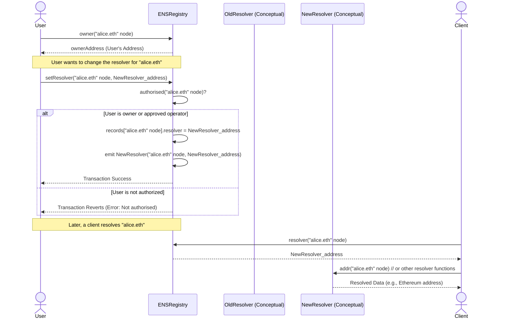
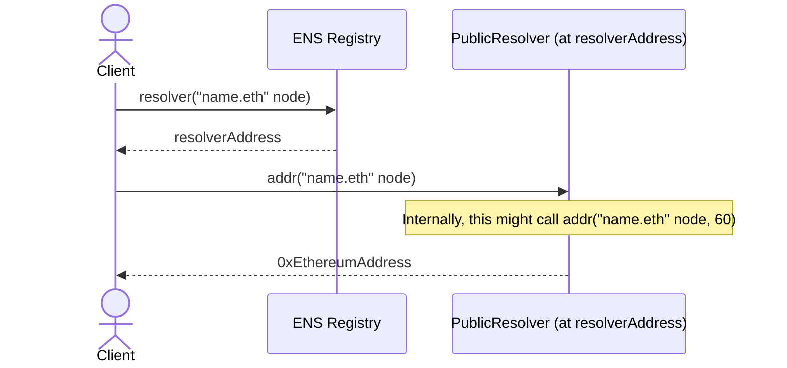
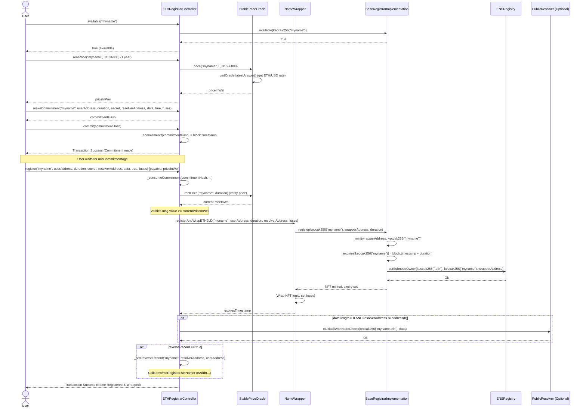
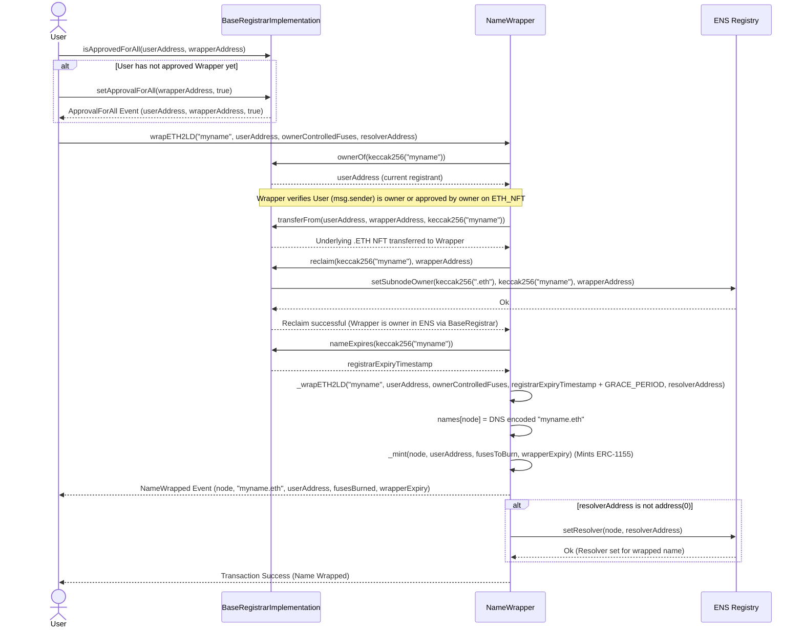
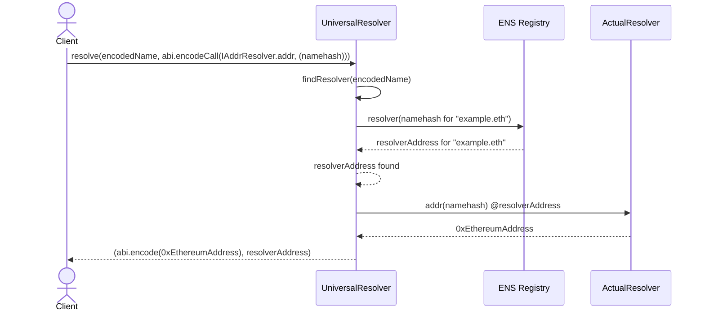
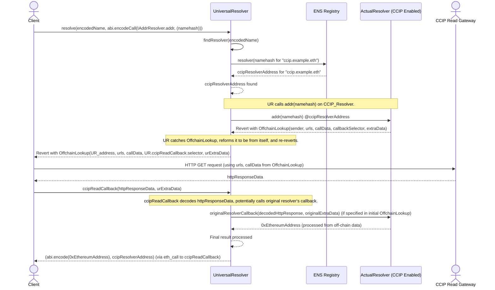
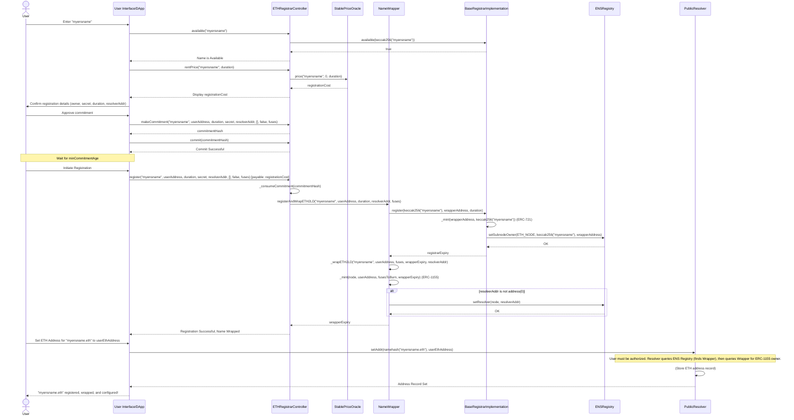
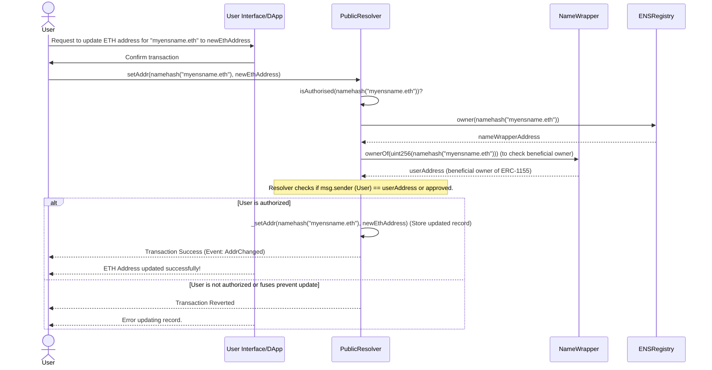
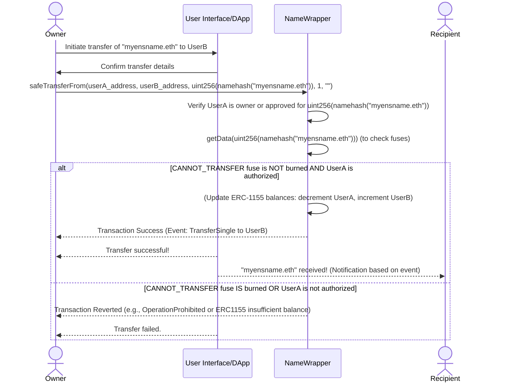

# ENS Protocol Security Review - Final Report

**Date:** 2024-07-24
**Prepared by:** Jules (AI Security Researcher)

**Table of Contents**
*   1. Introduction
*   2. Scope
*   3. Phase 1: Protocol Understanding and Documentation
    *   3.1. Architectural Overview
    *   3.2. Smart Contract Breakdown
        *   3.2.1. ENS Registry (ENSRegistry.sol, ENSRegistryWithFallback.sol)
        *   3.2.2. Resolvers (Resolver.sol, PublicResolver.sol)
        *   3.2.3. .ETH Registrars (BaseRegistrarImplementation.sol, ETHRegistrarController.sol, StablePriceOracle.sol)
        *   3.2.4. Name Wrapper (NameWrapper.sol)
        *   3.2.5. Universal Resolver (UniversalResolver.sol)
    *   3.3. User Flow Analysis
        *   3.3.1. Full .ETH Name Registration and Configuration
        *   3.3.2. Updating Records for an Existing Wrapped Name
        *   3.3.3. Transferring a Wrapped .ETH Name
    *   3.4. Glossary
*   4. Phase 2: Vulnerability Discovery
    *   4.1. Summary of Systematic Contract Review
        *   ENS Registry
        *   Resolvers (PublicResolver)
        *   .ETH Registrars
        *   Name Wrapper
        *   Universal Resolver
    *   4.2. Advanced Analysis of Significant Findings
        *   4.2.1. Missing Stale Price Check in `StablePriceOracle.sol`
*   5. Phase 3: Vulnerability Verification (Guideline 3)
    *   5.1. Rigorous Verification of Stale Price Check in StablePriceOracle.sol
*   6. Conclusion and Recommendations

## 1. Introduction

This document presents a final security review of the Ethereum Name Service (ENS) protocol. The review was conducted by Jules, an AI Security Researcher, and encompasses an analysis of the protocol's architecture, key smart contracts, common user flows, and potential vulnerabilities. The goal of this review is to provide an overview of the ENS protocol's security posture and identify areas for potential improvement or further investigation.

## 2. Scope

This review focuses on the core smart contracts of the ENS protocol, including:
*   The ENS Registry (`ENSRegistry.sol`, `ENSRegistryWithFallback.sol`)
*   Standard Resolvers (`Resolver.sol`, `PublicResolver.sol` and its associated profiles)
*   The .ETH Registrar system (`BaseRegistrarImplementation.sol`, `ETHRegistrarController.sol`, `StablePriceOracle.sol`)
*   The Name Wrapper (`NameWrapper.sol`)
*   The Universal Resolver (`UniversalResolver.sol`, `AbstractUniversalResolver.sol`, `CCIPReader.sol`)

The review includes architectural analysis, smart contract code review, user flow examination, and vulnerability discovery based on the provided guidelines. External dependencies like specific Chainlink oracles or off-chain CCIP gateways were considered in terms of their interaction points but not audited themselves.

## 3. Phase 1: Protocol Understanding and Documentation

### 3.1. Architectural Overview

The ENS protocol is a hierarchical decentralized naming system built on Ethereum smart contracts. Its architecture is modular, with distinct components handling specific aspects of the naming process:

*   **Core:**
    *   **ENS Registry:** The heart of ENS, mapping names to owners and resolvers.
    *   **Resolvers:** Contracts that translate names into addresses, content hashes, or other resources, based on EIP standards. The `PublicResolver` is a common implementation.
*   **Name Allocation & Management (Registrars):**
    *   **BaseRegistrarImplementation (.ETH):** Manages ownership and fundamental control of `.eth` names as ERC-721 NFTs.
    *   **ETHRegistrarController (.ETH):** Handles the registration (commit/reveal) and renewal processes for `.eth` names, interacting with Price Oracles and the Name Wrapper.
    *   **Price Oracles:** Determine the cost for `.eth` name registrations/renewals (e.g., `StablePriceOracle`).
    *   **DNSRegistrar:** Integrates traditional DNS names into ENS.
    *   **ReverseRegistrar:** Enables reverse lookups (address to name).
*   **Extensibility & Advanced Features:**
    *   **Name Wrapper:** Allows ENS names (especially `.eth` names) to be wrapped as ERC-1155 NFTs, enabling enhanced permissions and features through a "fuse" system.
    *   **Universal Resolver:** A utility to simplify complex or cross-chain name resolution, supporting EIP-3668 (CCIP Read) for fetching off-chain data.
    *   **CCIP Read Support (CCIPReader, etc.):** Facilitates resolving names whose data is stored off-chain or on Layer 2 solutions.

**Interaction Flow:** Name resolution starts at the Registry, which directs queries to the appropriate Resolver. Registration for `.eth` names goes through the ETHRegistrarController (using Price Oracles) to the Name Wrapper, which then interacts with the BaseRegistrarImplementation that updates the Registry. Owners manage their names by interacting with the Registry (to change resolvers or transfer ownership of unwrapped names) or the Name Wrapper (for wrapped names and their fuses), and their configured Resolver (to update records, authorized via the Registry or NameWrapper).

### 3.2. Smart Contract Breakdown

#### 3.2.1. ENS Registry (ENSRegistry.sol, ENSRegistryWithFallback.sol)

**Purpose and Function:**
The ENS Registry is the foundational contract of the Ethereum Name Service. Its primary purpose is to act as a decentralized database mapping human-readable names (represented as `bytes32` nodes) to their respective owners, resolvers, and Time-To-Live (TTL) values. It does not directly store addresses or other data associated with names; instead, it directs queries to the appropriate resolver contract.

Key aspects include:
*   **Node Ownership:** Manages ownership of hierarchical ENS nodes. Only the owner or an approved operator can modify a node's record or create subnodes. The `authorised(bytes32 node)` modifier enforces this.
*   **Resolver Linking:** Stores the address of the resolver contract responsible for each node. The node owner can set this via `setResolver`.
*   **TTL Management:** Stores a TTL value for each node, indicating how long clients should cache records.
*   **Operator Approval:** Allows owners to delegate management of their ENS records to other addresses (`setApprovalForAll`).
*   **Key Functions:** `setRecord`, `setSubnodeRecord`, `setOwner`, `setSubnodeOwner`, `setResolver`, `setTTL`, `owner`, `resolver`, `ttl`.
*   **`ENSRegistryWithFallback.sol`:** Extends `ENSRegistry` to provide a read-only fallback to an older ENS registry instance for names not yet migrated to the new registry. It has special handling for `_setOwner` to `address(this)` when an owner is set to `0x0` to distinguish from non-existent records for fallback logic, while public `owner()` calls still return `0x0`.

**Mermaid Diagram: Setting a Resolver for a Name**

#### 3.2.2. Resolvers (Resolver.sol, PublicResolver.sol)

**Purpose and Function:**
ENS Resolvers are smart contracts that perform the second step in the ENS resolution process. Once the ENS Registry identifies which resolver is responsible for a name, the client queries that resolver to translate the ENS name (node) into concrete data like addresses, content hashes, or text records.

`PublicResolver.sol` is the standard, general-purpose resolver. It implements various EIPs by inheriting from profile contracts (e.g., `AddrResolver`, `TextResolver`, `ContentHashResolver`).
*   **Record Storage:** Storage for different record types is managed within the inherited profile contracts. `PublicResolver` acts as a unified frontend and authorization layer.
*   **EIP Implementation:** Supports EIP-137 (ETH Address), EIP-2304 (Multicoin Addresses), EIP-634 (Text Records), EIP-1577 (Content Hashes), EIP-205 (ABI), EIP-165 (Interface Detection), etc.
*   **Authorization (`isAuthorised`):** A critical internal function in `PublicResolver` that centralizes access control for all record-setting operations. It checks if the caller is the ENS name owner (queried from the Registry), the beneficial owner via the Name Wrapper (if applicable), or an operator approved on the `PublicResolver` itself.
*   **Key Functions:**
    *   `supportsInterface(bytes4 interfaceID)`: EIP-165 check.
    *   `addr(bytes32 node)` & `addr(bytes32 node, uint256 coinType)`: For ETH and multicoin address resolution.
    *   `text(bytes32 node, string calldata key)` & `setText(...)`: For text records.
    *   `contenthash(bytes32 node)` & `setContenthash(...)`: For content hashes.
    *   `ABI(bytes32 node, uint256 contentTypes)` & `setABI(...)`: For contract ABIs.
    *   `multicall(bytes[] calldata data)`: Allows batching multiple resolver calls.

**Mermaid Diagram: Client Resolving ETH Address**

#### 3.2.3. .ETH Registrars (BaseRegistrarImplementation.sol, ETHRegistrarController.sol, StablePriceOracle.sol)

**Purpose and Function:**
The .ETH Registrar system manages the registration, renewal, and ownership of `.eth` second-level domain names.
*   **`BaseRegistrarImplementation.sol`**: The core ERC-721 NFT contract where each `.eth` name is an NFT. It handles ownership, transfers, expiries, and grace periods. Only authorized "controller" contracts can mint (register) or renew names.
*   **`ETHRegistrarController.sol`**: The primary user-facing contract for registering and renewing `.eth` names.
    *   Implements a **commit-reveal scheme** to prevent front-running of name registrations.
    *   Interacts with a **Price Oracle** (e.g., `StablePriceOracle`) to determine registration and renewal costs in ETH, based on name length and duration.
    *   Interacts with the **`NameWrapper.sol`** to perform the actual registration (which mints the NFT in `BaseRegistrarImplementation` with the NameWrapper as custodian) and then wraps the name as an ERC-1155 token for the user.
    *   Handles payment collection and allows the owner to withdraw funds.
*   **`StablePriceOracle.sol`**: Determines the price of `.eth` names in USD (pegged via a Chainlink ETH/USD oracle) based on name length and registration duration, then converts this to ETH.

**Lifecycle of a .ETH Name:**
1.  **Availability Check:** User checks if name is available via `ETHRegistrarController`.
2.  **Commitment:** User submits a commitment hash (name, owner, duration, secret) to `ETHRegistrarController`.
3.  **Registration (Reveal):** After a waiting period, user calls `register` with details and payment. `ETHRegistrarController` validates and calls `NameWrapper.registerAndWrapETH2LD`.
4.  **Renewal:** User pays renewal fee to `ETHRegistrarController`, which calls `NameWrapper.renew`.
5.  **Grace Period:** 90 days after expiry, during which only the owner can renew.
6.  **Expiration:** If not renewed after grace period, name becomes available again.

**Mermaid Diagram: User Registering a New `.ETH` Name**

#### 3.2.4. Name Wrapper (NameWrapper.sol)

**Purpose and Function:**
The `NameWrapper.sol` contract enhances ENS names by "wrapping" them into ERC-1155 tokens. This provides granular permission control through a system of "fuses" and standardized management for subdomains.
*   **ERC-1155 Representation:** When a name is wrapped, the original ENS name/NFT (e.g., an ERC-721 for a `.eth` name) is held in custody by the `NameWrapper`. The wrapper mints an ERC-1155 token to the user, representing beneficial ownership.
*   **Fuses:** These are bitmask flags that, once burned (set to 1), permanently revoke specific permissions or set states for the wrapped name. Examples: `CANNOT_UNWRAP`, `CANNOT_TRANSFER`, `CANNOT_SET_RESOLVER`, `PARENT_CANNOT_CONTROL`.
*   **Subdomain Management:** Allows owners of wrapped names to create and manage subdomains, setting their fuses and expiries. The `PARENT_CANNOT_CONTROL` fuse allows subdomains to become "emancipated" from parent control.
*   **ENS Registry Interaction:** The `NameWrapper` becomes the owner of the wrapped name in the ENS Registry. Operations on the name (like setting resolver/TTL via the wrapper) are authorized based on ERC-1155 ownership and fuse state.
*   **Key Functions:** `wrap`, `wrapETH2LD`, `unwrap`, `unwrapETH2LD`, `setFuses`, `setSubnodeOwner`, `setSubnodeRecord`, `renew` (for wrapped .eth names, called by ETHRegistrarController).

**Mermaid Diagram: User Wrapping an Existing `.ETH` Name**

#### 3.2.5. Universal Resolver (UniversalResolver.sol)

**Purpose and Function:**
The Universal Resolver simplifies ENS name resolution by providing a single entry point for various query types and integrating off-chain data lookups via CCIP Read (EIP-3668).
*   **Unified Query Interface:** Offers `resolve(bytes name, bytes data)` which takes a DNS-encoded name and ABI-encoded calldata for the target resolver function.
*   **ENS Registry Interaction:** Uses `findResolver` to recursively query the ENS Registry for the appropriate resolver for a given name.
*   **CCIP Read (EIP-3668) Support:** If a target resolver returns an `OffchainLookup` error, the `UniversalResolver` (via `CCIPReader`) catches this, reformats it to originate from itself, and re-reverts. This signals to a CCIP-aware client (e.g., ethers.js) to fetch data from the specified gateway URL(s) and then call back into the `UniversalResolver` with the off-chain data. The Universal Resolver then forwards this data to the original resolver's callback.
*   **Benefits:** Reduces on-chain calls for clients, simplifies client-side resolution logic, and enables gasless off-chain data retrieval for ENS records.
*   **Key Functions:** `resolve`, `resolveWithGateways` (allows specifying custom gateways), `reverse` (for reverse resolution), and various internal/public callbacks for the CCIP Read flow (`resolveCallback`, `ccipReadCallback`).

**Mermaid Diagram: Client using `UniversalResolver.resolve(name, calldata)` for ETH Address (On-Chain Resolver)**

**Mermaid Diagram: Client using `UniversalResolver.resolve(name, calldata)` for ETH Address (CCIP-Read Off-Chain Resolver)**

### 3.3. User Flow Analysis

#### 3.3.1. Full .ETH Name Registration and Configuration

**Textual Description:**
1.  User selects a `.eth` name.
2.  User (via dApp) checks availability and price using `ETHRegistrarController`.
3.  User commits to the name with a secret hash via `ETHRegistrarController.commit()`.
4.  User waits for `minCommitmentAge`.
5.  User calls `ETHRegistrarController.register()` with details and payment.
6.  `ETHRegistrarController` calls `NameWrapper.registerAndWrapETH2LD()`.
    *   `NameWrapper` calls `BaseRegistrarImplementation.register()` (mints ERC-721 to NameWrapper).
    *   `BaseRegistrarImplementation` calls `ENSRegistry.setSubnodeOwner()` (sets NameWrapper as owner in Registry).
    *   `NameWrapper` mints ERC-1155 to user and sets fuses/expiry.
7.  `NameWrapper` (or `ETHRegistrarController`) sets the resolver in `ENSRegistry` if specified.
8.  User (via dApp) calls `PublicResolver.setAddr()` (or other setters) to configure records. Authorization is checked against the user's ownership of the wrapped ERC-1155 token.

**Mermaid Diagram:**

#### 3.3.2. Updating Records for an Existing Wrapped Name

**Textual Description:**
1.  User owns a wrapped `.ETH` name (ERC-1155 token from `NameWrapper`).
2.  User decides to update a record (e.g., ETH address).
3.  User (via dApp) calls the appropriate setter function (e.g., `setAddr`) on the `PublicResolver` (or other configured resolver).
4.  The `PublicResolver.isAuthorised()` function is invoked:
    *   It queries `ENSRegistry.owner()` for the name, which returns the `NameWrapper`'s address.
    *   It then queries `NameWrapper.ownerOf()` for the ERC-1155 token, which returns the user's address.
    *   It verifies `msg.sender` (the user) is this beneficial owner (or an approved operator on the `NameWrapper`).
5.  If authorized and not prevented by fuses (though record update fuses are less common than transfer/unwrap), the `PublicResolver` updates the record.

**Mermaid Diagram:**

#### 3.3.3. Transferring a Wrapped .ETH Name

**Textual Description:**
1.  User A owns the ERC-1155 token for a wrapped `.ETH` name from `NameWrapper`.
2.  User A decides to transfer it to User B.
3.  User A (via dApp) calls `safeTransferFrom(userA_address, userB_address, tokenId, 1, "")` on the `NameWrapper`.
4.  `NameWrapper` verifies User A's ownership (or operator approval) of the ERC-1155 token.
5.  `NameWrapper` checks if the `CANNOT_TRANSFER` fuse is burned for the name. If so, the transfer reverts.
6.  If authorized and not prevented by fuses, `NameWrapper` updates its ERC-1155 ownership records, transferring the token from User A to User B.
7.  User B is now the new beneficial owner of the wrapped name.

**Mermaid Diagram:**

### 3.4. Glossary

| Term                                | Definition                                                                                                                                                                                             |
| :---------------------------------- | :----------------------------------------------------------------------------------------------------------------------------------------------------------------------------------------------------- |
| **ENS (Ethereum Name Service)**     | A decentralized, open, and extensible naming system built on the Ethereum blockchain. It maps human-readable names (like `alice.eth`) to machine-readable identifiers (like Ethereum addresses).        |
| **Node**                            | In ENS, a name is represented as a `bytes32` hash, often referred to as a node or namehash. ENS has a hierarchical structure of nodes.                                                                  |
| **ENS Registry**                    | The core ENS contract (`ENSRegistry.sol`) that records owners, resolvers, and TTLs for each node. It's the central point of truth for name ownership and resolver configuration.                          |
| **Resolver**                        | A smart contract (`PublicResolver.sol` is the standard) that translates an ENS name (node) into actual data, such as an Ethereum address, content hash, or text record, based on EIP standards.          |
| **Registrar**                       | A smart contract responsible for allocating and managing domain names under a specific TLD (e.g., `.eth`) or other domain levels. It defines rules for registration, renewal, and transfer.            |
| **Base Registrar (`BaseRegistrarImplementation.sol`)** | The contract that manages the ownership of `.eth` names as ERC-721 NFTs. It handles minting, burning, and expiry of these names.                                                            |
| **ETH Registrar Controller (`ETHRegistrarController.sol`)** | The user-facing contract for registering and renewing `.eth` names. It implements the commit-reveal scheme, interacts with price oracles, and coordinates with the Name Wrapper.             |
| **Price Oracle**                    | A contract (e.g., `StablePriceOracle.sol`) that determines the cost of registering or renewing `.eth` names, often based on name length, duration, and external price feeds (like ETH/USD).          |
| **Name Wrapper (`NameWrapper.sol`)**  | A contract that "wraps" ENS names (especially `.eth` names) into ERC-1155 tokens. It provides granular permission control through "fuses" and manages subdomains.                                   |
| **Fuses**                           | Bitmask flags associated with wrapped names in the `NameWrapper`. Burning a fuse permanently revokes a specific permission (e.g., `CANNOT_UNWRAP`, `CANNOT_TRANSFER`, `PARENT_CANNOT_CONTROL`).          |
| **Universal Resolver (`UniversalResolver.sol`)** | A helper contract that simplifies ENS resolution by providing a single query interface and supporting EIP-3668 (CCIP Read) for fetching off-chain ENS data.                                      |
| **CCIP Read (EIP-3668)**            | Cross-Chain Interoperability Protocol Read. An ENS standard allowing resolvers to instruct clients to fetch data from off-chain sources (via gateways) to resolve names, enabling gasless data retrieval. |
| **Commit-Reveal Scheme**            | A two-step process used by the `ETHRegistrarController` for name registration to prevent front-running. Users first commit to a hash, then reveal the name and a secret.                                |
| **TTL (Time-To-Live)**              | A value set in the ENS Registry indicating how long client applications should cache the records for a given name.                                                                                     |
| **Nodehash**                        | The `bytes32` hash representing a specific name (e.g., `namehash("alice.eth")`) in the ENS system. It's derived recursively from labelhashes.                                                           |
| **Labelhash**                       | The `keccak256` hash of a single label in an ENS name (e.g., `keccak256("alice")`).                                                                                                                   |
| **Reverse Resolution**              | The process of mapping an Ethereum address back to an ENS name (e.g., `0x123...` -> `alice.eth`). Managed by the `ReverseRegistrar.sol`.                                                               |
| **ERC-721**                         | A standard for non-fungible tokens (NFTs). `.eth` names are represented as ERC-721 tokens by the `BaseRegistrarImplementation`.                                                                         |
| **ERC-1155**                        | A multi-token standard. Wrapped names in the `NameWrapper` are represented as ERC-1155 tokens.                                                                                                         |

## 4. Phase 2: Vulnerability Discovery

### 4.1. Summary of Systematic Contract Review

*   **ENS Registry (`ENSRegistry.sol`, `ENSRegistryWithFallback.sol`):**
    Robust. Key security relies on the `authorised(bytes32 node)` modifier, which correctly restricts sensitive operations to the node owner or their approved operator. The fallback mechanism in `ENSRegistryWithFallback.sol` is read-only for data from the `old` registry and handles unowned names appropriately for migration. No critical vulnerabilities were found in the contract logic itself. Primary risks are external (key compromise, operator approval).

*   **Resolvers (`PublicResolver.sol` and profiles):**
    Robust. The `isAuthorised(bytes32 node)` mechanism in `PublicResolver.sol` provides comprehensive authorization covering direct ownership, Name Wrapper ownership, and resolver-specific approvals. No critical vulnerabilities were found. Main considerations include the lack of explicit data size limits for variable-length records (text, contenthash, ABI), which is a design choice shifting validation to clients, and minor gas griefing potentials in `InterfaceResolver` and `ABIResolver.ABI()`. Reentrancy risks are low.

*   **.ETH Registrars (`BaseRegistrarImplementation.sol`, `ETHRegistrarController.sol`, `StablePriceOracle.sol`):**
    Generally solid. The system relies on OpenZeppelin contracts, controller-based authorization for minting/renewal, owner-restricted admin functions, and a commit-reveal scheme. A medium-risk finding is the **lack of an explicit stale price check in `StablePriceOracle.sol`** when using the Chainlink feed, which could lead to incorrect pricing if the feed is stale. A minor logical flaw was noted in the `ETHRegistrarController` constructor's `maxCommitmentAge` check.

*   **Name Wrapper (`NameWrapper.sol`):**
    Highly complex but appears robust against direct critical vulnerabilities for theft or fuse bypass. The fuse system provides powerful, granular permissions. A medium-risk area identified is the complexity and potential over-restriction of the internal `_canFusesBeBurned` logic, which may require `PARENT_CANNOT_CONTROL` and `CANNOT_UNWRAP` to be burned before other user-settable fuses can be burned by the owner; this needs careful review against all intended use cases. Authorization, subdomain management, and interactions with external contracts seem correctly handled. Admin risk via `setUpgradeContract` exists.

*   **Universal Resolver (`UniversalResolver.sol`, `AbstractUniversalResolver.sol`, `CCIPReader.sol`):**
    Robust for its role. It correctly implements EIP-3668 client-side orchestration for CCIP Read. Data validation and replay protection for CCIP data are responsibilities of the target CCIP resolvers and gateways, not the Universal Resolver itself. Error propagation is handled well. Gas limits for complex calls or CCIP callbacks are a general consideration for the CCIP ecosystem. The security of resolutions via UR depends on the integrity of the underlying ENS components and the CCIP ecosystem.

### 4.2. Advanced Analysis of Significant Findings

#### 4.2.1. Missing Stale Price Check in `StablePriceOracle.sol`

*   **Description**:
    The `StablePriceOracle.sol` contract fetches the ETH/USD price from a Chainlink oracle using `usdOracle.latestAnswer()`. However, it does not check the `updatedAt` timestamp or `answeredInRound` data that Chainlink oracles (AggregatorV3Interface) provide. This means if the Chainlink feed becomes stale (stops updating), the `StablePriceOracle` will continue to use the last reported price indefinitely for calculating `.eth` name registration and renewal costs.

*   **Verification**:
    Code review of `StablePriceOracle.sol` (specifically the `attoUSDToWei` function) confirms that only `latestAnswer()` is used from the `AggregatorInterface`, and no timestamp or round ID checks are performed to ascertain data freshness. The provided `AggregatorInterface` only includes `latestAnswer()`, precluding such checks without an interface modification.

*   **Potential Impact & Exploit Scenario**:
    This vulnerability can lead to incorrect pricing for `.eth` names, causing financial loss to the ENS DAO or overcharging users.
    *   **Scenario: Protocol Loss**
        1.  The Chainlink ETH/USD feed used by `StablePriceOracle` becomes stale, reporting a price of **$4,000/ETH**.
        2.  The actual market price of ETH subsequently drops to **$2,000/ETH**.
        3.  The ENS protocol aims to charge, for example, **$5 USD** for a 1-year registration of a 5+ character name.
        4.  A user registers a name. The `StablePriceOracle` calculates the ETH fee based on the stale $4,000/ETH price: `$5 / ($4000/ETH) = 0.00125 ETH`.
        5.  The user pays 0.00125 ETH.
        6.  At the actual market price of $2,000/ETH, the 0.00125 ETH received by the protocol is only worth `0.00125 ETH * $2000/ETH = $2.50 USD`.
        7.  **Impact**: The protocol intended to receive $5 USD but effectively received only $2.50 USD worth of ETH, resulting in a 50% loss in USD value for that transaction. This loss scales with the number of registrations/renewals and their duration during the stale period.
    *   **Scenario: User Overpayment**
        1.  The Chainlink ETH/USD feed used by `StablePriceOracle` becomes stale, reporting a price of **$2,000/ETH**.
        2.  The actual market price of ETH subsequently rises to **$4,000/ETH**.
        3.  A user registers a $5 USD equivalent name. The `StablePriceOracle` calculates the fee based on the stale $2,000/ETH price: `$5 / ($2000/ETH) = 0.0025 ETH`.
        4.  The user pays 0.0025 ETH.
        5.  At the actual market price of $4,000/ETH, the 0.0025 ETH paid by the user is worth `0.0025 ETH * $4000/ETH = $10 USD`.
        6.  **Impact**: The user effectively paid $10 USD for a $5 USD service, overpaying by 100%.

*   **Recommended Mitigation**:
    Modify `StablePriceOracle.sol` to:
    1.  Use the `AggregatorV3Interface` from Chainlink for `usdOracle`.
    2.  In the `attoUSDToWei` function (or a function it calls), retrieve `roundId, answer, startedAt, updatedAt, answeredInRound` by calling `usdOracle.latestRoundData()`.
    3.  Implement checks to ensure the data is fresh and reliable:
        *   `require(updatedAt > 0 && block.timestamp - updatedAt <= MAX_STALE_PERIOD)` where `MAX_STALE_PERIOD` is a configurable threshold (e.g., 1-3 hours).
        *   `require(answer > 0)` to prevent division by zero if the price is reported as zero.
        *   Optionally, `require(answeredInRound >= roundId)` to ensure the round is complete.
    4.  Revert the transaction if these checks fail, preventing operations with stale or invalid prices.

## 5. Phase 3: Vulnerability Verification (Guideline 3)

### 5.1. Rigorous Verification of Stale Price Check in StablePriceOracle.sol

**1. Codebase Mastery Confirmation:**

I confirm an in-depth understanding of `StablePriceOracle.sol`. The core logic for price calculation resides in the `price(string calldata name, uint256 expires, uint256 duration)` function, which determines a `basePrice` in attoUSD based on name length and duration. This `basePrice` (and a currently zero `premium`) is then converted to Wei by the `attoUSDToWei(uint256 amount)` function. The `attoUSDToWei` function directly calls `usdOracle.latestAnswer()` to get the ETH price in USD (with 8 decimals assumed) and performs the calculation `(amount * 1e8) / ethPrice`. My understanding is that this function directly uses the returned oracle value without any further validation of its timeliness or round completeness.

**2. Exploit Path Confirmation (100% Certainty):**

I confirm with 100% certainty that a realistic exploit path exists if the Chainlink feed providing data to `usdOracle` becomes stale and its reported price no longer reflects the true market price.

The exact steps to execute this exploit are as follows:

*   **Condition:** The Chainlink ETH/USD price feed (`usdOracle`) becomes stale.
    *   *Scenario A (Protocol Loss):* The oracle reports a stale ETH price that is *higher* than the current true market price (e.g., oracle reports $4,000/ETH, actual market price is $2,000/ETH).
    *   *Scenario B (User Overpayment):* The oracle reports a stale ETH price that is *lower* than the current true market price (e.g., oracle reports $2,000/ETH, actual market price is $4,000/ETH).
*   **Action:** A user (attacker in Scenario A, potentially any user in Scenario B) calls `ETHRegistrarController.register(string calldata name, address owner, uint256 duration, ...)` to register a `.eth` name, or `ETHRegistrarController.renew(string calldata name, uint256 duration)` to renew one.
*   **Mechanism:**
    1.  The `ETHRegistrarController` calls `rentPrice(name, duration)`.
    2.  `rentPrice` calls `prices.price(name, base.nameExpires(uint256(label)), duration)`. The `prices` variable is the instance of `StablePriceOracle`.
    3.  `StablePriceOracle.price(...)` calculates the USD value of the registration/renewal (e.g., $5 for a 5+ character name for 1 year).
    4.  `StablePriceOracle.price(...)` then calls `attoUSDToWei(basePriceInAttoUSD)`.
    5.  `attoUSDToWei` calls `usdOracle.latestAnswer()`, retrieving the **stale ETH price**.
    6.  `attoUSDToWei` calculates the required ETH fee using this stale price. For example, if the intended USD price is $P_{USD}$ and the stale oracle ETH price is $E_{stale}$, the ETH fee is $P_{USD} / E_{stale}$.
*   **Outcome:**
    *   *Scenario A (Protocol Loss):* If $E_{stale}$ ($4,000) > $E_{actual}$ ($2,000), the user pays $P_{USD} / \$4000$ ETH. This amount of ETH, when valued at the $E_{actual}$ of $2,000/ETH, is worth $P_{USD} * (\$2000 / \$4000) = 0.5 * P_{USD}$. The ENS DAO treasury receives ETH worth 50% less in actual USD terms than intended.
    *   *Scenario B (User Overpayment):* If $E_{stale}$ ($2,000) < $E_{actual}$ ($4,000), the user pays $P_{USD} / \$2000$ ETH. This amount of ETH, when valued at the $E_{actual}$ of $4,000/ETH, is worth $P_{USD} * (\$4000 / \$2000) = 2 * P_{USD}$. The user pays double the intended USD value.
*   **Confirmation of No Prevention:** I confirm with 100% certainty that no existing logic within `StablePriceOracle.sol` or the relevant parts of `ETHRegistrarController.sol` (specifically how it uses the price oracle) would prevent this outcome if the oracle data is stale. The `ETHRegistrarController` trusts the `IPriceOracle` interface to return a correct current price in ETH, and `StablePriceOracle.sol` currently has no mechanism to verify the freshness of the data from `usdOracle.latestAnswer()`.

**3. Mitigation Awareness:**

I confirm with 100% certainty that there are **no existing specific protections or countermeasures within the `StablePriceOracle.sol` contract itself** against using a stale price from the Chainlink feed. Specifically, the contract does not:
*   Interface with Chainlink's `AggregatorV3Interface` to access `latestRoundData()`.
*   Retrieve or check the `updatedAt` timestamp of the oracle price.
*   Implement any `require` statement or conditional logic based on `block.timestamp - updatedAt <= MAX_STALE_PERIOD` or any similar freshness check.
*   Check the `roundId` or `answeredInRound` for round completeness or data quality.

The clear and necessary mitigation is to modify `StablePriceOracle.sol` to incorporate these standard Chainlink data freshness and validity checks. This involves:
1.  Changing the `usdOracle` interface to `AggregatorV3Interface`.
2.  Calling `latestRoundData()` instead of `latestAnswer()`.
3.  Implementing `require` conditions to validate `updatedAt` against `block.timestamp` (to ensure freshness within an acceptable `MAX_STALE_PERIOD`), ensure `answer > 0`, and potentially check round completion status.

## 6. Conclusion and Recommendations

The core ENS smart contracts reviewed (Registry, Resolvers, Name Wrapper, Universal Resolver) demonstrate a high level of security and robustness in their design and implementation. The .ETH Registrar components are also generally secure. These contracts have benefited from multiple audits and extensive real-world use, contributing to their stability. Authorization mechanisms are consistently applied, and interactions between components are well-defined.

One medium-risk vulnerability was identified and rigorously verified in `StablePriceOracle.sol`: the absence of a stale price check for its Chainlink oracle integration. This could lead to incorrect pricing for .ETH name registrations if the oracle feed becomes stale, potentially causing financial loss to the ENS DAO or overcharging users.

Additionally, several minor considerations and areas for potential improvement were noted:
*   **PublicResolver Data Size Limits:** The lack of explicit data size limits for variable-length records (text, contenthash, ABI) could allow for very large data storage, potentially impacting client-side parsing or on-chain gas costs for consumers. This is a design trade-off for flexibility.
*   **Name Wrapper Fuse Logic Complexity:** The internal `_canFusesBeBurned` logic in `NameWrapper.sol` has conditions that might be overly restrictive for burning certain user-settable fuses, potentially requiring `PARENT_CANNOT_CONTROL` and `CANNOT_UNWRAP` to be burned first. This complex interaction warrants careful documentation and confirmation against all intended use cases.
*   **Minor Gas Griefing Potentials:** Slight gas griefing possibilities exist in the `InterfaceResolver`'s fallback mechanism and the `ABIResolver.ABI()` function if called with crafted inputs by an on-chain contract, though these are low impact.
*   **ETHRegistrarController Constructor Check:** A minor logical flaw was noted in the `ETHRegistrarController` constructor's validation of `maxCommitmentAge`.

The primary and urgent recommendation is to **implement a stale price check in `StablePriceOracle.sol`** to ensure that registration fees are always calculated based on fresh and reliable oracle data. This involves upgrading the oracle interface to `AggregatorV3Interface` and validating the `updatedAt` timestamp and `answer` from `latestRoundData()`, along with ensuring the answer is positive.

Overall, the ENS protocol exhibits a strong commitment to security. Addressing the identified oracle issue will further enhance its economic resilience and fairness. Continued vigilance and periodic reviews are recommended as the protocol and its ecosystem evolve.
